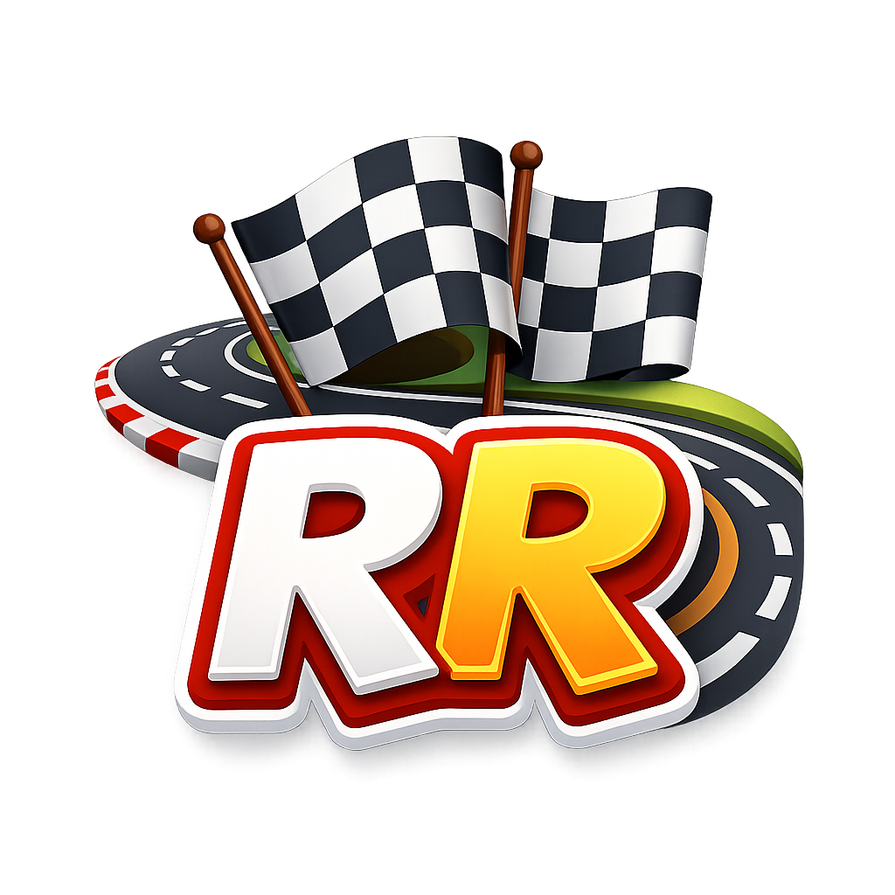

<div align="center">
  
  <h1>🍕 Rodízio Race 🍣</h1>
  
  <p>
    <strong>O contador definitivo para competições de rodízio.</strong><br>
    Gerencie suas fatias, compita com amigos em tempo real e descubra quem é o verdadeiro "Lendário Comilão".
  </p>

  <p>
    <a href="https://rodiziorace.mechama.eu">
      
    </a>
    
    
    
    
  </p>
</div>

<br />

## 📖 Sobre o Projeto

O **Rodízio Race** é uma aplicação web interativa desenvolvida para gamificar a experiência de ir a rodízios de Pizza, Sushi, Hambúrguer ou Bebidas. A aplicação permite criar salas privadas onde os participantes registram o consumo em tempo real, gerando um ranking ao vivo.

O projeto utiliza **Next.js 14 (App Router)** para o frontend e **Supabase** para backend e banco de dados em tempo real.

### ✨ Principais Funcionalidades

- 🏃 **Competição em Tempo Real:** Atualizações instantâneas via Supabase Realtime.
- 🍕 **Multicategorias:** Suporte para Pizza, Sushi, Burger e Bebidas.
- 🤝 **Modo Equipes:** Jogue individualmente ou divida a mesa em times (Azul, Vermelho, Verde, Amarelo).
- 👤 **Sistema de Contas:** Login persistente, histórico de partidas e avatares exclusivos.
- 🌍 **Internacionalização (i18n):** Suporte completo para Português (BR), Inglês e Espanhol.
- 📱 **PWA Ready:** Otimizado para dispositivos móveis (instalação na tela inicial).
- 🏆 **Hall da Fama:** Gere imagens compartilháveis para Stories do Instagram ao final da partida.
- 🎫 **Códigos Promocionais:** Sistema para resgate de avatares e recursos exclusivos.
- 📸 **Photo Mode (Privado):** Fotos obrigatórias por ponto (somente logados), timeline privada e expira em 2 dias.

---

## 🛠️ Tecnologias Utilizadas

- **Framework:** [Next.js 14](https://nextjs.org/) (App Router)
- **Linguagem:** [TypeScript](https://www.typescriptlang.org/)
- **Estilização:** [Tailwind CSS](https://tailwindcss.com/) + [Shadcn/UI](https://ui.shadcn.com/)
- **Ícones:** [Lucide React](https://lucide.dev/)
- **Backend & DB:** [Supabase](https://supabase.com/) (PostgreSQL + Auth + Realtime)
- **Fontes:** Geist Sans & Mono

---

## 🚀 Como Rodar o Projeto

### Pré-requisitos

- Node.js 18+ instalado.
- Uma conta no [Supabase](https://supabase.com/).

### Photo Mode (Privado)

- Execute a migration: `scripts/010_add_photo_mode_and_race_photos.sql`
- Bucket privado necessário: `race-photos`
- Deploy da Edge Function: `supabase/functions/cleanup-race-photos`
- (Opcional) Agende o cleanup via SQL: `scripts/011_schedule_cleanup_race_photos.sql`

### 1. Clone o repositório

```bash
git clone [https://github.com/seu-usuario/rodizio-race.git](https://github.com/seu-usuario/rodizio-race.git)
cd rodizio-race
```
